<div align="center">

# 🌌 Parallax Operator

[](https://github.com/matanryngler/parallax/releases/latest)
[](https://github.com/matanryngler/parallax/actions/workflows/ci.yml)
[](https://codecov.io/gh/matanryngler/parallax)
[](https://goreportcard.com/report/github.com/matanryngler/parallax)
[](https://opensource.org/licenses/Apache-2.0)

[](https://github.com/matanryngler/parallax/pkgs/container/parallax)
[](https://github.com/matanryngler/parallax/releases)
[](https://kubernetes.io/)
[](https://golang.org/)

**Dynamic parallel execution for Kubernetes workloads**

*Transform any list into parallel, scalable Jobs with enterprise-grade reliability*

[🚀 Quick Start](#-quick-start) • [📖 Documentation](#-documentation) • [💡 Examples](#-examples) • [🤝 Community](#-community)

</div>

---

## ✨ What is Parallax?

Parallax is a **production-ready Kubernetes operator** that enables **dynamic, list-driven parallel execution** of Jobs and CronJobs. It abstracts away the complexity of sharding workloads over a list of inputs — whether from APIs, databases, or static lists — and manages concurrency, indexing, and job orchestration transparently.

### 🎯 Key Features

| Feature | Description | Benefits |
|---------|-------------|----------|
| **🔄 Dynamic Data Sources** | REST APIs, PostgreSQL, Static Lists | Real-time data processing |
| **⚡ Parallel Execution** | Configurable concurrency with indexed jobs | Faster processing, better resource utilization |
| **📅 Cron Scheduling** | Built-in cron scheduling with concurrency policies | Automated recurring workflows |
| **🔒 Enterprise Security** | RBAC, signed images, vulnerability scanning | Production-ready security |
| **📊 Multi-Platform** | linux/amd64, linux/arm64 support | Run anywhere |
| **🎛️ Flexible Configuration** | Environment variables, resource limits, custom templates | Fits any use case |

### 🏗️ Architecture Overview

```mermaid
graph TB
    subgraph "Data Sources"
        A1[🌐 REST APIs]
        A2[🗄️ PostgreSQL]  
        A3[📝 Static Lists]
    end
    
    subgraph "Parallax Operator"
        B1[ListSource Controller]
        B2[ListJob Controller]
        B3[ListCronJob Controller]
    end
    
    subgraph "Kubernetes Resources"
        C1[📦 ConfigMaps]
        C2[⚙️ Jobs]
        C3[⏰ CronJobs]
        C4[🏃‍♂️ Pods]
    end
    
    A1 --> B1
    A2 --> B1  
    A3 --> B1
    B1 --> C1
    C1 --> B2
    C1 --> B3
    B2 --> C2
    B3 --> C3
    C2 --> C4
    C3 --> C4
    
    style B1 fill:#e1f5fe
    style B2 fill:#e1f5fe
    style B3 fill:#e1f5fe
    style C1 fill:#f3e5f5
    style C2 fill:#e8f5e8
    style C3 fill:#fff3e0
```



### 🚦 How It Works

1. **📋 ListSource** fetches your data and creates a ConfigMap with items
2. **🔀 ListJob** reads the ConfigMap and creates parallel Kubernetes Jobs  
3. **⏰ ListCronJob** schedules ListJobs to run on cron schedules
4. **🏃‍♂️ Each Job** processes one item with the item available as an environment variable

---

## 🚀 Quick Start

### Prerequisites

- Kubernetes 1.20+ cluster
- Helm 3.0+ (recommended)
- `kubectl` configured

### Installation

#### Option 1: Helm from GHCR OCI Registry (Recommended)

Modern OCI-based installation using GitHub Container Registry:

```bash
# Step 1: Install CRDs first
helm install parallax-crds oci://ghcr.io/matanryngler/charts/parallax-crds --version 0.1.0

# Step 2: Install the operator
helm install parallax oci://ghcr.io/matanryngler/charts/parallax --version 0.1.0

# Or customize the operator installation
helm install parallax oci://ghcr.io/matanryngler/charts/parallax --version 0.1.0 \
  --set replicaCount=2 \
  --set resources.limits.memory=512Mi
```

#### Option 2: Helm from GitHub Releases (Traditional)

Classic installation method using direct download:

```bash
# Step 1: Install CRDs first
helm install parallax-crds \
  https://github.com/matanryngler/parallax/releases/latest/download/parallax-crds-0.1.0.tgz

# Step 2: Install the operator
helm install parallax \
  https://github.com/matanryngler/parallax/releases/latest/download/parallax-0.1.0.tgz
```

#### Option 3: Local Charts (Development)

For development or when you have the repository cloned:

```bash
# Install CRDs
helm install parallax-crds ./charts/parallax-crds

# Install operator
helm install parallax ./charts/parallax
```

### Verify Installation

```bash
# Check if the operator is running
kubectl get deployment parallax -n parallax-system

# Verify CRDs are installed
kubectl get crd | grep batchops.io
```

---

## 💡 Examples

### Example 1: Process API Results

```yaml
# Create a ListSource that fetches user IDs from an API
apiVersion: batchops.io/v1alpha1
kind: ListSource
metadata:
  name: user-api-source
spec:
  type: api
  intervalSeconds: 300  # Refresh every 5 minutes
  api:
    url: "https://jsonplaceholder.typicode.com/users"
    jsonPath: "$[*].id"
    headers:
      Content-Type: "application/json"
---
# Process each user ID in parallel
apiVersion: batchops.io/v1alpha1
kind: ListJob
metadata:
  name: process-users
spec:
  listSourceRef: user-api-source
  parallelism: 5
  template:
    image: curlimages/curl:latest
    command: 
      - "sh"
      - "-c"
      - "echo 'Processing user $USER_ID' && curl -s https://jsonplaceholder.typicode.com/users/$USER_ID"
    envName: USER_ID
    resources:
      requests:
        cpu: "100m"
        memory: "128Mi"
      limits:
        cpu: "500m"
        memory: "256Mi"
```

### Example 2: Database-Driven Processing

```yaml
# Secret for database credentials
apiVersion: v1
kind: Secret
metadata:
  name: postgres-credentials
type: Opaque
stringData:
  username: "myuser" 
  password: "mypassword"
---
# ListSource that queries PostgreSQL
apiVersion: batchops.io/v1alpha1
kind: ListSource
metadata:
  name: database-source
spec:
  type: postgresql
  intervalSeconds: 600  # Refresh every 10 minutes
  postgres:
    connectionString: "host=postgres.example.com port=5432 dbname=mydb sslmode=require"
    query: "SELECT order_id FROM orders WHERE status = 'pending' ORDER BY created_at"
    auth:
      secretRef:
        name: postgres-credentials
        key: password
      passwordKey: password
---
# Process each pending order
apiVersion: batchops.io/v1alpha1  
kind: ListJob
metadata:
  name: process-orders
spec:
  listSourceRef: database-source
  parallelism: 10
  template:
    image: my-order-processor:latest
    command: ["./process-order"]
    envName: ORDER_ID
    resources:
      requests:
        cpu: "200m"
        memory: "256Mi"
```

### Example 3: Scheduled Processing

```yaml
# Daily processing of a static list
apiVersion: batchops.io/v1alpha1
kind: ListCronJob
metadata:
  name: daily-reports
spec:
  schedule: "0 2 * * *"  # Every day at 2 AM
  parallelism: 3
  template:
    image: my-report-generator:latest
    command: ["./generate-report"]
    envName: REPORT_TYPE
    resources:
      requests:
        cpu: "500m"
        memory: "1Gi"
  staticList:
    - "sales-report"
    - "inventory-report" 
    - "customer-report"
  concurrencyPolicy: Forbid
  successfulJobsHistoryLimit: 5
  failedJobsHistoryLimit: 2
```

---

## 📊 Performance & Scalability

### Benchmarks

| Metric | Value | Notes |
|--------|--------|-------|
| **Max Concurrent Jobs** | 1000+ | Limited by cluster resources |
| **Items per Second** | 500+ | Depends on job complexity |
| **Memory Usage** | ~128Mi | Operator base memory |
| **CPU Usage** | ~100m | Operator base CPU |
| **Startup Time** | <30s | Time to process first job |

### Resource Requirements

| Component | Minimum | Recommended | Max Tested |
|-----------|---------|-------------|------------|
| **CPU** | 100m | 500m | 2 cores |
| **Memory** | 128Mi | 256Mi | 1Gi |
| **Jobs** | 1 | 50 | 1000+ |

---

## 🔧 Configuration

### ListSource Types

#### 📡 REST API Configuration

```yaml
spec:
  type: api
  api:
    url: "https://api.example.com/items"
    jsonPath: "$.data[*].id"  # JSONPath to extract items
    headers:                  # Custom headers
      Authorization: "Bearer token"
      Content-Type: "application/json"
    auth:                     # Optional authentication
      type: bearer            # or 'basic'
      secretRef:
        name: api-credentials
        key: token
```

#### 🗄️ PostgreSQL Configuration

```yaml
spec:
  type: postgresql
  postgres:
    connectionString: "host=db.example.com port=5432 dbname=mydb"
    query: "SELECT id FROM items WHERE processed = false"
    auth:
      secretRef:
        name: db-credentials
        key: password
      passwordKey: password
```

#### 📝 Static List Configuration

```yaml
spec:
  type: static
  staticList:
    - "item-1"
    - "item-2"
    - "item-3"
```

### Environment Variables

| Variable | Description | Default |
|----------|-------------|---------|
| `METRICS_BIND_ADDRESS` | Metrics server address | `:8080` |
| `LEADER_ELECT` | Enable leader election | `false` |
| `LOG_LEVEL` | Log level (debug, info, warn, error) | `info` |
| `NAMESPACE` | Watch specific namespace | All namespaces |

---

## 📖 Documentation

| Resource | Description |
|----------|-------------|
| [📚 User Guide](https://github.com/matanryngler/parallax/wiki) | Complete usage documentation |
| [🔧 Installation Guide](charts/README.md) | Detailed installation options |
| [👩‍💻 API Reference](https://github.com/matanryngler/parallax/blob/main/api/v1alpha1/README.md) | CRD specifications |
| [🤝 Contributing](CONTRIBUTING.md) | How to contribute |
| [🚀 Changelog](https://github.com/matanryngler/parallax/releases) | Release notes |

---

## 🛠️ Development

### Local Development

```bash
# Clone the repository
git clone https://github.com/matanryngler/parallax.git
cd parallax

# Install dependencies and run tests  
make ci-quick

# Build the operator
make build

# Run locally (requires kubeconfig)
make run
```

### Testing

```bash
# Unit tests with coverage
make test

# E2E tests (creates isolated Kind cluster)
make test-e2e

# All CI checks locally (matches GitHub Actions exactly)
make ci-all
```

### Pre-commit Validation

```bash
# Run the same checks as CI
./scripts/pre-commit.sh
```

---

## 📊 Monitoring & Observability

### Prometheus Metrics

The operator exposes comprehensive metrics for monitoring:

```prometheus
# Items processed by ListSource
parallax_listsource_items_total{name="my-source", namespace="default", type="api"}

# Job execution duration
parallax_listjob_duration_seconds{name="my-job", namespace="default"}

# Error counters
parallax_errors_total{controller="listsource", error_type="fetch_failed"}
```

### Health Checks

```bash
# Health endpoint
curl http://localhost:8081/healthz

# Readiness endpoint  
curl http://localhost:8081/readyz

# Metrics endpoint
curl http://localhost:8080/metrics
```

---

## 🔒 Security

### Container Security

- ✅ **Signed Images**: All images signed with [Cosign](https://sigstore.dev/)
- ✅ **SBOM Included**: Software Bill of Materials for compliance
- ✅ **Vulnerability Scanning**: Regular scans with [Trivy](https://trivy.dev/)
- ✅ **Minimal Base Images**: Distroless images for reduced attack surface

### Kubernetes Security

- ✅ **RBAC**: Minimal required permissions only
- ✅ **NetworkPolicies**: Secure network communications  
- ✅ **PodSecurityStandards**: Restricted pod security context
- ✅ **Secret Management**: Secure handling of credentials

### Verify Image Signatures

```bash
# Verify the container image signature (replace v1.2.3 with actual version)
cosign verify ghcr.io/matanryngler/parallax:v1.2.3 \
  --certificate-identity "https://github.com/matanryngler/parallax/.github/workflows/release.yml@refs/tags/v1.2.3" \
  --certificate-oidc-issuer "https://token.actions.githubusercontent.com"
```

---

## 🤝 Community

### Getting Help

- 💬 [GitHub Discussions](https://github.com/matanryngler/parallax/discussions) - Q&A and community
- 🐛 [Issues](https://github.com/matanryngler/parallax/issues) - Bug reports and feature requests
- 📖 [Wiki](https://github.com/matanryngler/parallax/wiki) - Detailed documentation
- 🔒 [Security Issues](https://github.com/matanryngler/parallax/security/advisories) - Private security reports

### Contributing

We welcome contributions! Here's how to get started:

1. 🍴 **Fork** the repository
2. 🌟 **Star** the project (helps others discover it!)
3. 🔧 **Create** a feature branch: `git checkout -b feature/my-feature`
4. 📝 **Commit** your changes: `git commit -am 'Add my feature'`
5. 📤 **Push** to the branch: `git push origin feature/my-feature`
6. 🔄 **Create** a Pull Request

### Code of Conduct

This project adheres to the [Contributor Covenant Code of Conduct](CODE_OF_CONDUCT.md). By participating, you are expected to uphold this code.

---

## 📈 Roadmap

### Current Version (v0.1.x)
- ✅ Core ListSource, ListJob, ListCronJob functionality
- ✅ REST API and PostgreSQL data sources
- ✅ Multi-platform container images
- ✅ Helm charts and comprehensive testing

### Upcoming (v0.2.x)
- 🔄 MySQL and MongoDB data sources
- 🔄 Webhook-triggered jobs
- 🔄 Advanced scheduling policies
- 🔄 Grafana dashboards

### Future (v1.0.x)
- 🔄 Job dependency management
- 🔄 Advanced retry strategies
- 🔄 Multi-cluster support
- 🔄 Plugin architecture

---

## 📊 Project Stats

<div align="center">

[](https://github.com/matanryngler/parallax/stargazers)
[](https://github.com/matanryngler/parallax/network/members)
[](https://github.com/matanryngler/parallax/watchers)

[](https://star-history.com/#matanryngler/parallax&Date)

</div>

---

## 📝 License

This project is licensed under the **Apache License 2.0** - see the [LICENSE](LICENSE) file for details.

---

<div align="center">

**Made with ❤️ by the Parallax community**

[⭐ Star this project](https://github.com/matanryngler/parallax/stargazers) • [🐛 Report Issues](https://github.com/matanryngler/parallax/issues) • [💬 Join Discussions](https://github.com/matanryngler/parallax/discussions)

</div>